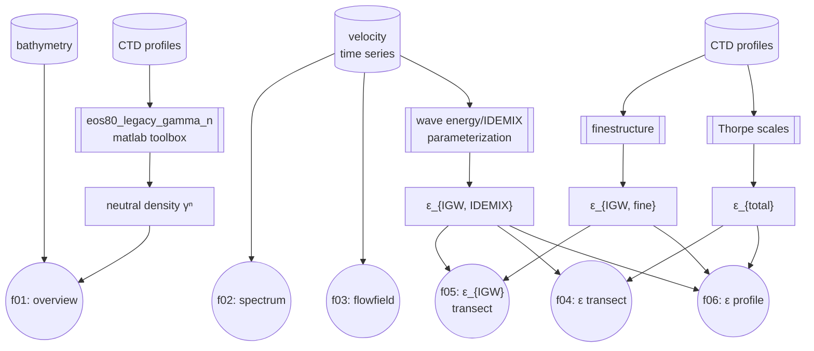

  

# Analysis code to: [Pinner et al., 2024](https://doi.org/10.5194/egusphere-2024-2444)

This is the analysis code to the for open peer-review submitted publication  
[**Pinner et al., 2024:** *Internal-wave-induced dissipation rates in the Weddell Sea Bottom Water gravity current*](https://doi.org/10.5194/egusphere-2024-2444), 

## Disclaimer
- Although this code produces the results and figures to the accompanying paper, this repository still contains unused code snippets and unfinished documentation. 
The repository will be cleaned up further during the review process, while making sure that the output remains the same.
This may include the renaming of files or functions to better communicate their purpose.
- Comments or corrections to the code can be given on GitHub as issues or discussions or on EGUsphere as a community reviewer.  
- Note that figures created here can differ slightly from the submitted versions, as some post-processing (adjustements and labeling) were made with *Inkscape*. 

## Structure
The figures 1 to 6 are produced from data as follows:

* Data (1st level) is referenced from the `./data` directory (but not committed to repository)
* Methods (2nd level) are in the `./scripts` directory
* Methods results (3rd level) are in the respective `./scripts/<method_name>/method_results` directories
* Figures (4th level) are produced by the scripts in the `./results` directory
